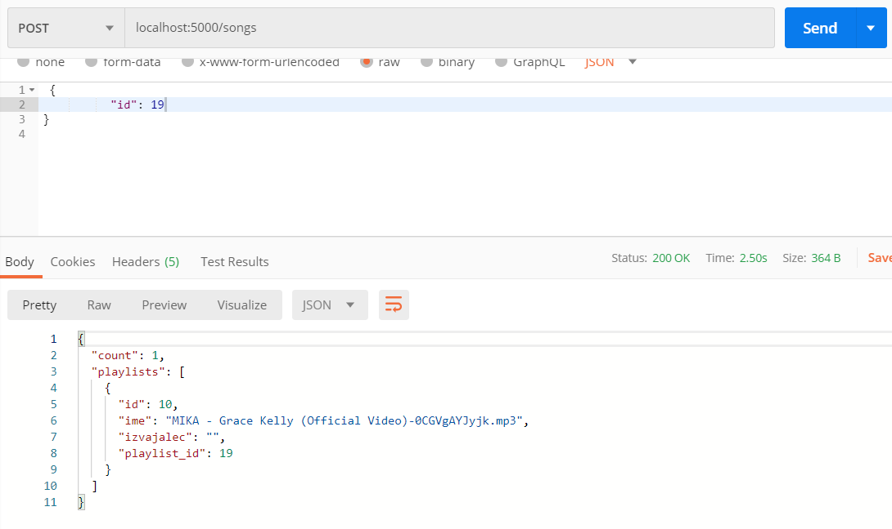

# api_flask_music2go
This is aplication programming interface for music2go application in Java. It enables you to save playlists from youtube, and see songs for them... and of course download them. So you insert a name for playlist and its url and you get all the songs from playlist downloaded onto your computer.

# !Disclaimer
In some countries act of downloading music from youtube can be illigal or even cause fines. However it is definitely prohibited by youtubes licence and agreements.

   <src="api_fotos/Screenshot_1.png" width="900" height="400"/>


## Getting started
1. Download the project
2. ```pip install -r /path/to/requirements.txt``` (all needed libraries)
3. position yourself into master directory
3. Run: ```python app.py``` (from terminal)

## Prerequisites
* Python 3.8

## Built with
* Flask
* SQLAlchemy
* youtube_dl
* ffmpeg

## License


## Authors
```Python
AUTHOR = "Luka Lah"; ##https://github.com/Lahlukap669
```
